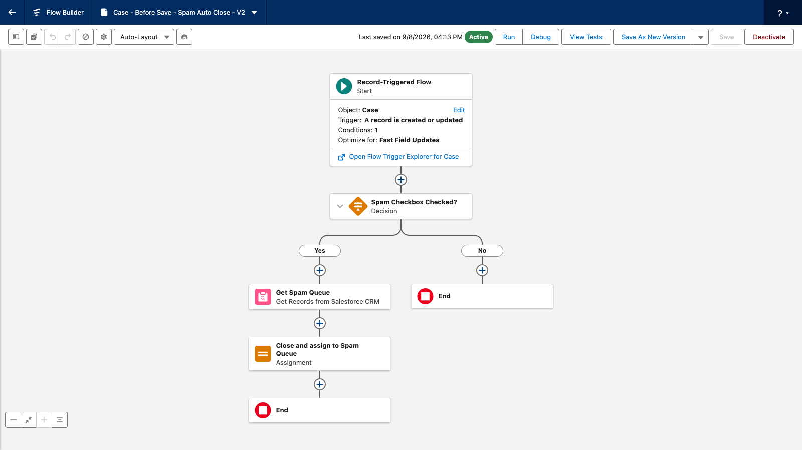
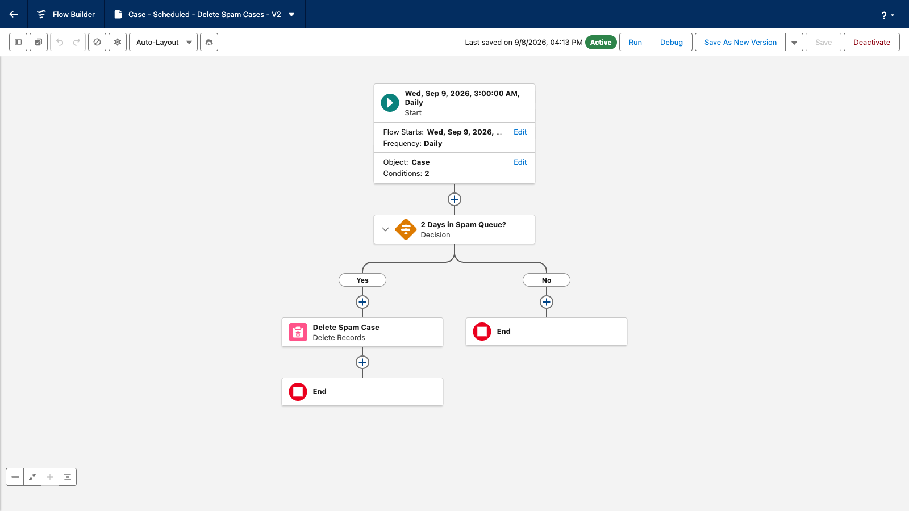
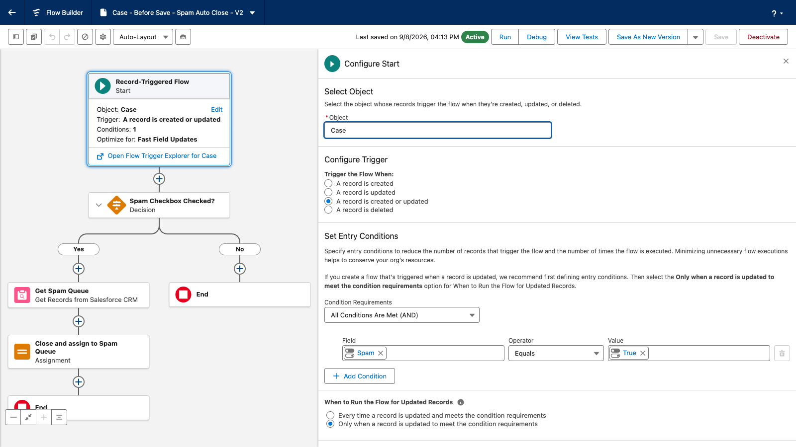
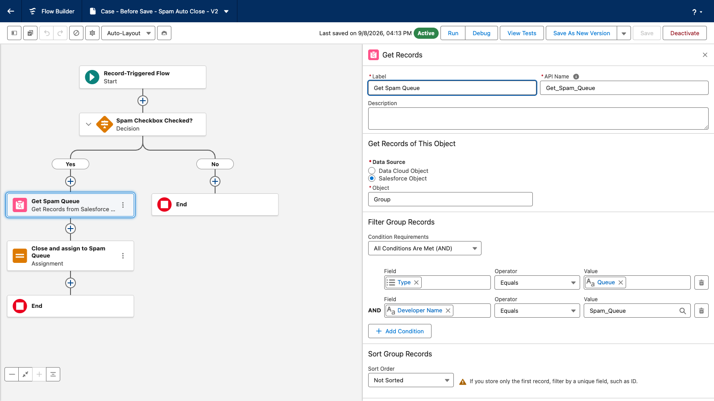
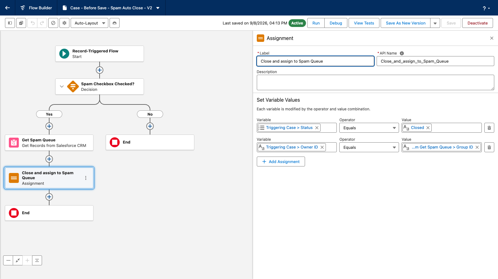
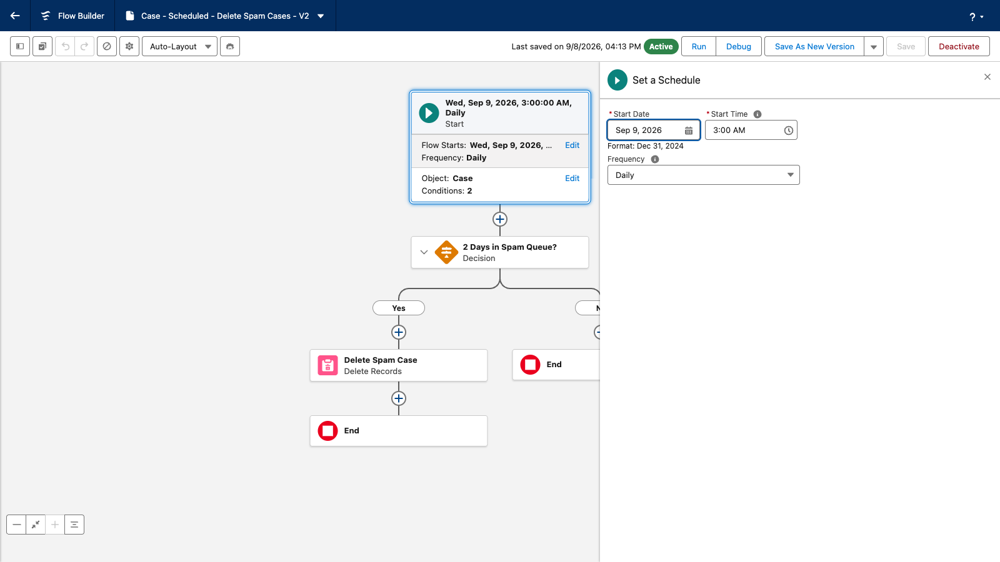
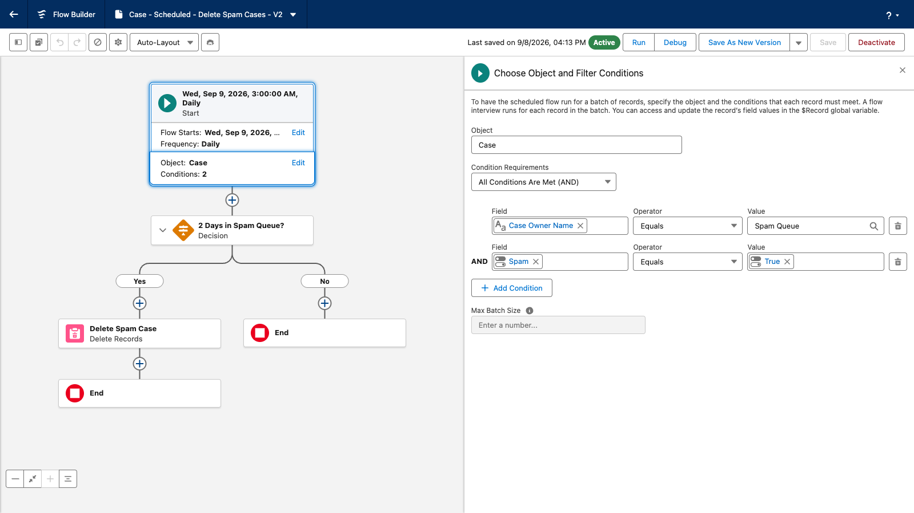
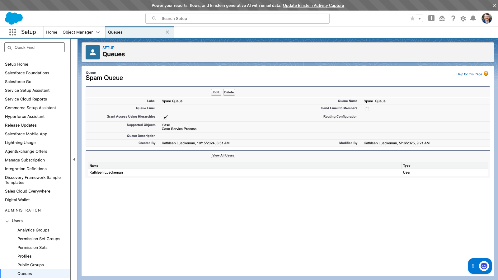
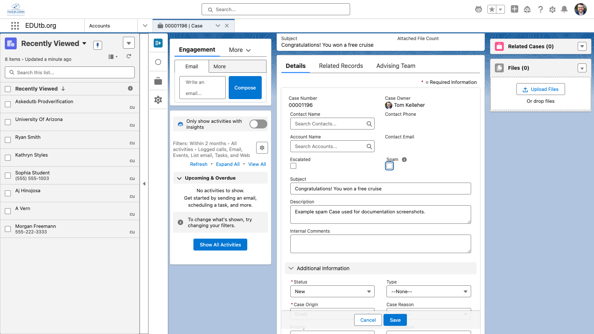
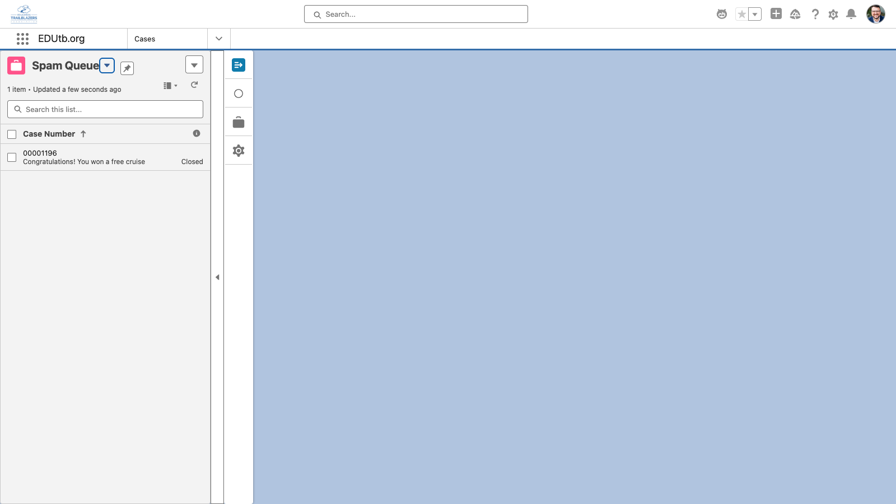

# Case Spam Automation — Setup & User Guide

> This guide mirrors the internal Knowledge Article *"Case Spam Automation (Internal)"* (Solution Version 1.1).

## Overview

When using Email-to-Case, spam messages create Cases that clog up your support Queue. The **Case Spam Automation** solution lets agents deal with spam in one click: checking the **Spam** checkbox on a Case immediately closes it and moves it out of the working queue into a dedicated **Spam Queue**. A scheduled job then permanently deletes spam Cases after they have sat in the Spam Queue for the retention period (2 days).

The solution consists of two Flows and one custom field, supported by a Queue you create during setup:

- **Case - Before Save - Spam Auto Close** — record-triggered Flow that closes and re-routes flagged Cases
- **Case - Scheduled - Delete Spam Cases** — schedule-triggered Flow that deletes old spam Cases daily

## How It Works

1. **Agent flags spam.** An agent checks the **Spam** checkbox on a Case and saves.
2. **Case closes and moves.** Before the record is saved, the Flow sets the Case Status to **Closed** and changes the Owner to the **Spam Queue**. Because this happens before save, no extra update is needed and the change is instant.
3. **Scheduled cleanup.** Every day at 3:00 AM (UTC), the scheduled Flow finds Cases owned by the Spam Queue that are flagged as Spam, and deletes any that were closed more than 2 days ago. Deleted Cases go to the Recycle Bin.

## Flow Details

### Case - Before Save - Spam Auto Close

Record-Triggered Flow on **Case** (created or updated), running **before save** (fast field update).

| Element | Type | What it does |
|---|---|---|
| Start | Record trigger (before save) | Fires when a Case is created or updated with **Spam = true**, only when the record is changed to meet the condition. |
| Get Spam Queue | Get Records | Looks up the Queue (Group object) where Type = *Queue* and Developer Name = **Spam_Queue** (first record only). |
| Close and assign to Spam Queue | Assignment | Sets Status = **Closed** and Owner = the Spam Queue. Committed with the triggering save — no separate update. |

### Case - Scheduled - Delete Spam Cases

Schedule-Triggered Flow on **Case**, running **daily at 3:00 AM (UTC)**. Runs as the Automated Process user.

| Element | Type | What it does |
|---|---|---|
| Start | Schedule trigger (Daily) | Selects Cases where **Case Owner Name = "Spam Queue"** and **Spam = true**. |
| f_TwoDaysAgo | Formula (Date) | `{!$Flow.CurrentDate} - 2` — the retention cutoff. |
| 2 Days in Spam Queue? | Decision | Checks the Case's **Closed Date** is earlier than the cutoff (closed more than 2 full days ago). |
| Delete Spam Case | Delete Records | Deletes the Case. It goes to the Recycle Bin. |

## Data Dictionary

| Component | API Name (unmanaged / packaged) | Type | Purpose |
|---|---|---|---|
| Flow | `Case_Before_Save_Spam_Auto_Close` | Record-Triggered Flow (before save) | Closes flagged Cases and reassigns them to the Spam Queue |
| Flow | `Case_Scheduled_Delete_Spam_Cases` | Schedule-Triggered Flow | Deletes spam Cases 2+ days after closure, daily at 3:00 AM UTC |
| Field | `Case.Spam__c` / `Case.EDUtb__Spam__c` | Checkbox | Agent-facing spam flag; entry condition for both Flows |
| Field | `Case.Case_Owner_Name__c` / `Case.EDUtb__Case_Owner_Name__c` | Formula (Text) | Case Owner's name; used by the scheduled Flow's entry conditions |
| Queue | `Spam_Queue` ("Spam Queue") | Queue on Case | Holding queue for flagged Cases; looked up by Developer Name — **created manually during setup** |

## Installation

Install the **EDUtb Case Spam** unlocked package (install link distributed separately), or deploy this repository's source with `sf project deploy start`. Then complete the manual setup below — the package cannot create these items for you.

## Setup (Manual Configuration)

1. **Create the Spam Queue.** Setup → Queues → New.
   - Label: **Spam Queue**
   - Queue Name (Developer Name): must be exactly **`Spam_Queue`** — the Flow looks it up by this API name.
   - Supported Objects: add **Case**.
   - Members: none required (nobody needs to work these Cases).

   

2. **Expose the Spam checkbox.** Add the **Spam** field to the Case page layout(s)/Lightning record pages used by your support team, and grant Edit access on the field (field-level security) to agent profiles or permission sets.

   

3. **Confirm a Closed status exists.** The Flow sets Status to **Closed**; make sure your Case support process includes it.

4. **Activate the Flows.** Both Flows must be Active. For *Case - Scheduled - Delete Spam Cases*, confirm the schedule shows **Daily** with a future start date/time.

5. **Verify Email-to-Case routing** assigns inbound Cases to your working queue as usual — this solution only moves Cases out of it when flagged.

## Verifying the Setup

1. Create a test Case (any origin) and check the **Spam** checkbox, then save.
2. Confirm the Case is now **Closed** and owned by **Spam Queue**.

   

3. Deletion can be verified after the retention period, or by opening the scheduled Flow in Flow Builder and using **Debug**.

## Known Limitations & Troubleshooting

- **Flag spam on existing Cases.** If a Case is *created* with the Spam checkbox already checked through a channel that runs Case Assignment Rules (Email-to-Case, API with auto-assign, or the "Assign using active assignment rules" checkbox), the assignment rule runs after this automation and overrides the owner — the Case ends up closed but back in the working queue, and it will not be auto-deleted. The normal pattern — an agent checking Spam on an existing Case and saving — is unaffected.
- **Do not rename the Spam Queue.** The scheduled Flow matches Cases by the queue's *name* ("Spam Queue") via the Case Owner Name formula field. Renaming the queue label silently stops deletion. Renaming the queue's Developer Name breaks the before-save re-routing.
- **Deletion is real.** Deleted Cases go to the Recycle Bin (recoverable for 15 days by an admin), then are gone. Flagged Cases also count toward data storage until deleted.
- **Nothing happens when I check Spam:** confirm both Flows are Active, the queue Developer Name is exactly `Spam_Queue`, and the user has edit access to the Spam field.
- **Cases aren't being deleted:** open the scheduled Flow and confirm the schedule is **Daily** with a start date in the past or today; check that flagged Cases are owned by the Spam Queue and closed more than 2 days ago.
- **Un-flagging:** unchecking Spam does not reopen the Case or move it back — manually change Status and Owner if a Case was flagged in error, and do it within the retention window.

## Changelog

- **v1.1.1 (2026-09-08):** Removed the redundant "Spam Checkbox Checked?" decision from the before-save Flow — its field reference failed to resolve in namespaced (packaged) orgs, and the start entry conditions already guarantee the check.
- **v1.1 (2026-09-08):** Fixed spam checkbox field reference in the before-save Flow; scheduled Flow set to run Daily (was one-time); retention aligned to 2 days; documentation rewritten.
- **v1.0:** Initial release.
